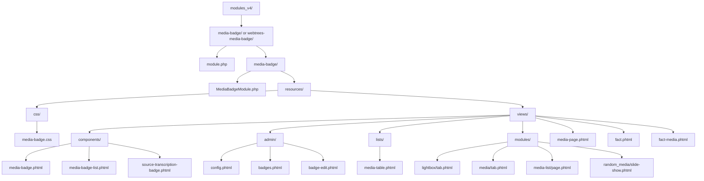
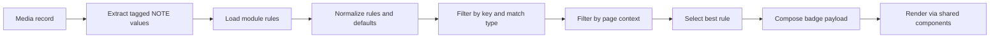

# Architecture

This document describes the current architecture of the Media Badge module.

## Overview

Media Badge adds configurable visual badges to media titles in webtrees.

The module is built around a central rule-resolution pipeline:

1. read tagged note values from media-related note content
2. normalize rule configuration
3. resolve the best matching badge rule for each value
4. apply page-context visibility
5. compose final badge data
6. render the result through small reusable view components

The core architectural goal is to keep badge logic centralized in the module class while keeping view templates as thin as possible.

## Supported installation layouts

The module currently supports two installation layouts:

```text
modules_v4/media-badge/
modules_v4/webtrees-media-badge/
```

The first layout is the lean module folder layout.
The second layout supports direct installation from the GitHub repository archive.

## Project structure

### Project structure as Mermaid diagram



### File tree

```text
modules_v4/
└── media-badge/ or webtrees-media-badge/
    ├── module.php
    └── media-badge/
        ├── MediaBadgeModule.php
        └── resources/
            ├── css/
            │   └── media-badge.css
            └── views/
                ├── media-page.phtml
                ├── fact.phtml
                ├── fact-media.phtml
                ├── components/
                │   ├── media-badge.phtml
                │   ├── media-badge-list.phtml
                │   └── source-transcription-badge.phtml
                ├── lists/
                │   └── media-table.phtml
                ├── modules/
                │   ├── lightbox/
                │   │   └── tab.phtml
                │   ├── media/
                │   │   └── tab.phtml
                │   ├── media-list/
                │   │   └── page.phtml
                │   └── random_media/
                │       └── slide-show.phtml
                └── admin/
                    ├── config.phtml
                    ├── badges.phtml
                    └── badge-edit.phtml
```

## Core responsibilities

### `module.php`

Bootstrap entry point used when the module is loaded directly from the repository root installation layout.

### `media-badge/MediaBadgeModule.php`

Central module class.

Main responsibilities:

- register namespaces and custom views
- load and store module configuration
- normalize configured note keys
- normalize configured badge rules
- extract tagged values from note content
- resolve matching rules for a media record
- apply page-context visibility
- compose final badge payloads for rendering
- provide shared constants and helper methods for supported contexts

This file is the architectural center of the module.

### `resources/css/media-badge.css`

Shared styling for:

- visual badge rendering
- badge list layout
- icon-only badges
- generic admin preview output

### `resources/views/components/`

Reusable rendering fragments.

#### `media-badge.phtml`

Renders a single prepared badge.

It expects an already composed badge payload and should not contain matching or extraction logic.

#### `media-badge-list.phtml`

Resolves all badges for a media record in a given page context and renders only the badges for the requested position.

This is the main reusable entry point used by context-specific views.

#### `source-transcription-badge.phtml`

Optional compatibility fragment for the `hh_source_transcription` module.

It is defensive by design:

- no hard dependency on the external module
- renders output only when the required service is available
- otherwise outputs nothing

### `resources/views/admin/`

Administrative configuration views.

#### `config.phtml`

Manages global note keys.

#### `badges.phtml`

Displays the rule overview, including visibility contexts and a preview of configured output.

#### `badge-edit.phtml`

Edits a single badge rule, including:

- key
- match rule
- render mode
- icon settings
- label settings
- tooltip settings
- CSS class
- position
- sort order
- page-context visibility

### Context-specific integration views

These templates integrate the shared badge components into concrete webtrees rendering contexts.

Their responsibility is to:

- provide the current media record
- provide the requested position (`before-title` or `after-title`)
- provide the current page context
- keep rendering integration small and local

They should not contain independent badge-matching logic.

## Runtime flow

The effective runtime pipeline is:

1. extract note values from a media record
2. load stored badge rules
3. normalize rules and defaults
4. determine candidate rules for each extracted value
5. filter candidates by page context
6. rank candidates by match strength and sort order
7. build final badge payloads
8. render through shared components

### Runtime flow as Mermaid diagram



In short:

**Extraction → Normalization → Matching → Visibility → Selection → Composition → Rendering**

## Content vs presentation

The module follows a strict separation of concerns:

- **content** comes from note-based metadata
- **presentation** comes from badge rules
- **rendering** is delegated to shared view components

This means:

- note content defines the raw value
- rules define how the value should look
- views only display already prepared output

This separation keeps the same note structure reusable even when the visual badge design changes later.

## Page-context visibility

Badge visibility is controlled through the rule field `page_contexts`.

Typical supported contexts are:

- `all`
- `media-page`
- `media-list`
- `linked-media-table`
- `album-tab`
- `media-tab`
- `random-media-slide-show`

### Responsibility rule

Views provide the current page context.
The module decides whether a rule is visible in that context.

This keeps visibility logic centralized and avoids duplicating conditional logic across multiple templates.

### Backward compatibility

If `page_contexts` is missing or empty, it is normalized to:

```json
["all"]
```

### Effective visibility behavior

If a rule is not valid in the current page context:

- no badge is rendered
- no tooltip is rendered
- no empty placeholder markup is generated

## Fallback behavior

The module supports generic fallback output when no value-specific rule matches.

The effective behavior is:

1. **No rules exist for the key**
   - create a generic fallback badge
2. **Rules exist for the key, but none are visible in the current context**
   - render nothing
3. **Visible rules exist for the key, but none match the current value**
   - create a generic fallback badge

This prevents badge output from leaking into contexts where the rule was intentionally disabled, while still preserving useful output for unconfigured values.

## View-to-context mapping

The following mapping should be used consistently:

| View file | Context |
|---|---|
| `media-page.phtml` | `media-page` |
| `lists/media-table.phtml` | `linked-media-table` |
| `modules/media-list/page.phtml` | `media-list` |
| `modules/lightbox/tab.phtml` | `album-tab` |
| `modules/media/tab.phtml` | `media-tab` |
| `modules/random_media/slide-show.phtml` | `random-media-slide-show` |
| `fact.phtml` | `media-tab` for direct media facts in fact/event views |
| `fact-media.phtml` | `media-tab` for nested media objects in fact/event views |

This mapping connects concrete rendering entry points to the central badge visibility model.

## Fact and event media rendering

A special part of the architecture is support for media objects rendered inside fact and event views.

There are two relevant paths:

### Direct media facts

Direct media facts can be rendered through `fact.phtml`.

In this path, the media object is directly available and the badge components can be attached to the title output.

### Nested media objects

Nested media objects referenced inside fact or event GEDCOM blocks can be rendered through `fact-media.phtml`.

In this path, the module resolves nested `OBJE` references to actual media records and then reuses the normal badge rendering pipeline.

This keeps nested media support aligned with the same rule model and rendering components used elsewhere.

## Compatibility strategy

The module should prefer compatibility through **small reusable rendering fragments** over full template ownership wherever possible.

That means:

- prefer small insertion points over large custom copies of core views
- reuse shared components instead of duplicating rendering logic
- avoid hard dependencies on third-party modules
- use defensive compatibility layers when external integrations are optional

### Theme and module compatibility

In practice, some contexts still require full or partial view overrides because webtrees and themes can replace entire templates.

Examples include:

- album or lightbox tabs
- media tabs
- fact/event rendering paths
- theme-specific view conflicts

Where a generic hook point is not available, the module may still need to override a view. Even in those cases, the override should remain as small and focused as possible.

## Architectural principles

The main architectural principles of the module are:

- extract note-based content once
- resolve rules centrally
- apply visibility centrally
- keep rendering components reusable
- keep integrations thin and context-aware
- prefer optional compatibility over hard coupling

This makes the module easier to maintain and easier to extend later with:

- user-group or access-level visibility
- additional badge sources beyond notes
- local icon asset management
- richer admin previews
- additional theme compatibility work

## Related documents

- `docs/configuration.md`
- `docs/rule-model.md`
